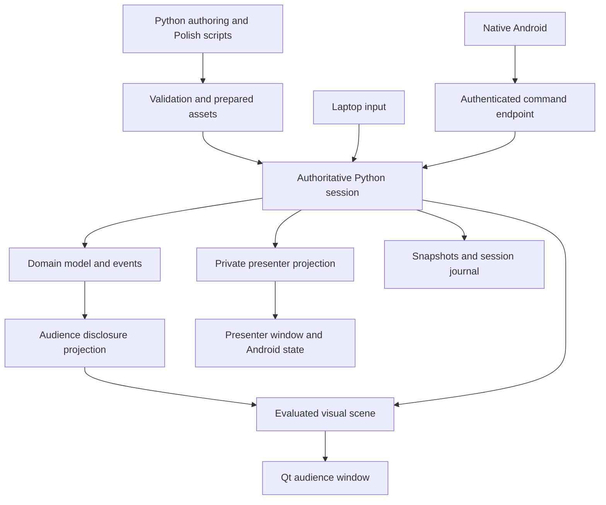

# Live Explain: planning proposal

Status: approved design baseline. The first desktop vertical slice is now implemented; see README.md and VALIDATION.md for actual capabilities and evidence. The illustrative API and later milestones below remain proposals, not claims that every planned feature exists.

## A. System and non-goals

Build a live presentation instrument. The audience sees an intentionally composed technical explanation; the presenter privately chooses pacing, prepared explanations, and the appropriate canonical narrative. Python is the implementation and authoring core.

Defining requirements: three canonical versions of the same narrative, persistent animated scenes, visible semantic data flow, code and hex components, exact interruption/resumption, authored cross-canonical landings, synchronized branching scripts, and eventual native Android control. The host never infers comprehension or advances the narrative on its own.

This is not a general slide editor, video generator, IDE, arbitrary navigation graph, full CPU emulator, remote shell, or automatic teaching planner. A real exploit or reliable hardware side channel is not a dependency.

The first talk targets approximately 20 minutes. Reserve approximately 16 minutes for explanation and four for questions, bridges, and recovery. The provisional Normal spine allocates two minutes to values/addresses, three to cache and timing, three to transient work, four to a Spectre example, three to Meltdown and comparison, and one to recap. These are rehearsal budgets, not timed automatic advances.

Simple, Normal, and Deep each reach the same conclusion within that broad envelope. Simple spends more time establishing terms; Deep spends less on basics and more on the mechanism's assumptions. Deep is not permission to silently turn the talk into 45 minutes. More extensive material remains a prepared detour or future longer edition. Do not compress every possible detail into three equally crowded routes.

Use Polish audience text and script, English internal identifiers and documentation. Route names stay private. No intelligence rankings or patronizing analogies. Use concrete values and observable consequences.

## B. Decisions and actual target

Confirmed decisions: the current laptop hosts the session under Hyprland; the audience application is fullscreen on the HDMI projector; the private presenter window stays on the laptop; mobile is Android only; the talk is roughly 20 minutes; the repository is public and must eventually include meaningful executable tests.

The verified development-machine hardware class is x86-64 Linux with integrated Intel graphics and approximately 16 GB RAM. No runtime graphics benchmark was performed. HDMI is not connected during planning, and an active compositor could not be queried from the execution session. Keep raw machine diagnostics out of this public repository.

Remaining decisions do not block design:

- Actual projector resolution, refresh, aspect ratio, and viewing distance: determine legibility and target frame budget. Prototype 1080p, 720p, and a 4:3 viewport before room testing.
- Hyprland fullscreen behavior with the attached HDMI display: validate ordinary Qt fullscreen and explicit output selection. No custom window manager, compositor adapter framework, or workspace-restoration system. If initial placement needs correction, use normal Hyprland window movement during setup; add a narrow documented window rule only if actual testing requires it.
- Android device/version and venue network restrictions: determine minimum SDK, pairing UX, and tested transport arrangement. Start with local Wi-Fi/hotspot and manual address entry; no cloud dependency.
- Exact Python/PySide pairing: verify wheel availability and package it in an isolated environment. Do not depend on the rolling system interpreter or replace it.

Recommendation: one desktop process and one authoritative command dispatcher initially. A second process is justified only by a demonstrated failure-isolation need.

## C. Foundation comparison and recommendation

| Criterion | PySide6 / Graphics View | PySide6 / Qt Quick | Manim / Manim Slides |
|---|---|---|---|
| Text/vector geometry | Direct Qt text layout and painter paths | Scene graph text/shapes; precise custom span integration needs care | Strong authored mathematical graphics |
| Continuous live updates | Direct item updates; representative throughput unverified | Accelerated retained rendering; bridge and backend costs unverified | Strong prepared animation; arbitrary live semantic updates require additional architecture |
| Two independent views | Audience scene plus presenter Widgets | Audience Quick window plus presenter Widgets or Quick | Presentation player exists; this branching-script runtime remains custom |
| Displays/high DPI | Qt facilities; compositor behavior must be tested | Qt facilities plus graphics-backend testing | Target player/window behavior needs testing |
| Code/hex/scroll/clipping | Natural custom-component fit | Feasible, but exact code ports are a prototype risk | Usually rendered content rather than live reusable model-backed widgets |
| Seeking/capture | Application evaluator plus scene rendering | Application evaluator plus synchronized capture | Prepared frames/clips are straightforward; live model restoration is extra |
| Offline packaging | Qt/Python/assets | Qt/Python/QML/plugins/assets | Rendered assets plus player, or authoring dependencies |
| Complexity for this project | Lowest initial mismatch | Greater rendering capacity, more integration work | Fast for prepared movies; less suited to the complete instrument |

**Primary recommendation:** PySide6, Widgets for presenter UI, Graphics View for the audience. **Fallback:** replace the audience renderer with Qt Quick if measured animation demands justify it; retain Python authoring, runtime, and domain model. Do not maintain both as production backends initially.

Qt documents Graphics View's item coordinates, transforms, multiple views, and custom geometry. These capabilities fit this project; they do not establish Python frame rates. [Graphics View](https://doc.qt.io/qt-6/graphicsview.html)

Qt Quick provides a retained scene graph and vector Shape items. Python should own narrative, model events, layout policy, scripts, and authoritative playback position; QML should describe reusable visual presentation. No independent narrative decisions or unmanaged animation callbacks in QML. [Scene graph](https://doc.qt.io/qtforpython-6/overviews/qtquick-visualcanvas-scenegraph.html), [Shape](https://doc.qt.io/qt-6/qml-qtquick-shapes-shape.html)

Do not put the entire dynamic scene into a giant QQuickPaintedItem and assume it gains all scene-graph advantages. Image-backed rendering entails texture uploads; accelerated alternatives have backend and quality tradeoffs. [QQuickPaintedItem](https://doc.qt.io/qt-6/qquickpainteditem.html)

Manim Slides supports presentation through a GUI or browser. It can later supply prepared supporting media, but should not own the session runtime. [Manim Slides](https://manim-slides.eertmans.be/latest/)

Qt's community/commercial licenses and third-party notices need a module-specific distribution review. Manim itself is MIT; dependencies and players require separate inventory. Public source does not automatically resolve redistribution obligations or select a license for this project's original code. Make that choice before the first code release. [Qt licenses](https://doc.qt.io/qtforpython-6/licenses.html), [Manim license](https://github.com/ManimCommunity/manim/blob/main/LICENSE)

The feasibility decision must be based on the stress scene in K, not a moving rectangle. Start without native extensions; investigate measured text layout, routing, binding, and paint costs before choosing a faster backend or extension.

## D. Modules and state ownership

Keep five responsibilities, initially implemented with ordinary modules and small typed records:

1. **Authoring and validation:** Python content definitions, script resources, reference validation, asset preparation.
2. **Session runtime:** commands, narrative, playback evaluator, coverage ledger, snapshots, recovery journal.
3. **Reusable diagrams:** layout rules, ports/routes, code, memory, tokens, branches, semantic styles.
4. **Desktop application:** Qt rendering, presenter surface, input, display management, local controller endpoint.
5. **Presentation content:** three routes, scripts, examples, and a separate Spectre educational model.

Android consumes the command/state protocol. It shares neither a copy of the domain simulation nor navigation business logic.



| State | Authority | Reconstruction/restoration |
|---|---|---|
| Narrative | Canonical, checkpoint context, beat, detour frames, selected return plan | Navigation transaction snapshots |
| Subject | Domain entities, values, model-event cursor | Domain snapshot plus deterministic event replay |
| Visual staging | Composition, stable IDs, camera, authored overrides, route topology/version | Evaluate geometry and styling from staging and playback position |
| Playback | Sequence, segment, position, hold, mode, seed | Exact suspension or evaluation from known entry |
| Presenter | Selected cue/full text, focus, manual assessments, elapsed-time policy | Restore relevant script/focus; retain actual elapsed talk time |
| Connection | Host epoch, controller identity, acknowledgments, health | Never restored from a narrative snapshot |

Narrative position, simulated execution progress, visual playback time, and wall-clock presentation time are distinct. Ambient phase is another visual quantity with no authority over narrative. Advancing a CPU conditional is a subject event; taking a detour is a narrative command.

Separate accepted commands, model events, and coverage milestones even if stored in the same journal. Model mutations occur serially on the host. Workers can prepare assets but cannot update the live session directly.

## E. Narrative and return semantics

Exactly one canonical is active, including while it is temporarily suspended for a detour. Three routes are ordered authored sequences, with correspondence through concepts rather than slide numbers or timestamps. Checkpoints declare intended coverage and next-entry assumptions; they do not certify comprehension.

Maintain distinct authored coverage, actually delivered milestones, and optional presenter assessments. Skipping an animation does not manufacture understanding. A milestone may declare content delivered, but this remains evidence of exposure only.

Supported cross-route landings specify requirements, a fresh model/visual entry recipe, and an optional named bridge. Compute missing coverage by simple set comparison. Offer the authored bridge, an earlier landing, or a visible warning/explicit override. Do not search an arbitrary graph to invent teaching sequences.

A detour frame contains origin, precise suspension, script position, detour identity, delivered detour coverage, selected return plan, and parent. Default detours use a separate model initialized from an explicit read-only selection of origin facts. No accidental write-back to the interrupted example.

Bound nesting at two frames. Ordinary Return pops one. An explicitly selected canonical landing closes all active detour frames; the presenter sees that outcome before committing. Closed frames remain in bounded undo history, not active navigation.

Operations are distinct: resume exact origin; enter a compatible landing in the same canonical; enter another canonical; cancel the latest navigation transaction. Restoration of a model snapshot and construction of a target entry state are not interchangeable.

### Exact worked return

Normal / cache-timing: request read_17 has been issued, its response is not committed, and transfer_17 is at 42% of a route. Code focus, camera, highlights, random seed, event cursor, routes, and script cue are known.

1. Open cache-location. Freeze and capture that state before transitioning. Push one frame. Enter the separate cache-location example and its Polish script.
2. Explain location by expanding the recognizable processor representation. The old model remains suspended. Record only coverage milestones actually reached.
3. Choose Resume Normal. Transition to the saved layout and restore model, playback, code focus, highlights, routes, and transfer at 42%. It returns **paused**, even if previously playing.
4. Show: “Wiemy już, gdzie znajduje się pamięć podręczna. Wróćmy do przerwanego odczytu.” Then recover the original cue and continue on Play. No model event executes twice.

The frame is popped. Elapsed presentation time and delivered detour coverage remain current. Exactness means logical scene/motion state under the pinned content version; a changed physical viewport may alter pixels.

### Alternative return to Deep

1. From cache-location, select Deep / distinguish-probe-accesses.
2. The target requires timing observability and cache-line treatment. Location alone supplies neither the unfinished timing conclusion nor necessarily cache lines.
3. Run the explicitly authored bridge that establishes those gaps, with its own model and script. No silent completion of read_17.
4. Enter Deep using its named initial cache contents, memory, code focus, disclosure state, and playback hold. Preserve processor identity through an explicit visual mapping, not by transplanting the Normal simulation.
5. Show the Deep return/transition sentence. Close the active detour stack and change the canonical to Deep. Normal's snapshot stays in undo history; its transfer is no longer scheduled.

Changing depth directly while paused uses the same landing mechanism. Undo can restore the prior navigation state, but cannot undo words already spoken; historical exposure and current entry assumptions remain separate.

## F. Visual system

Start with one restrained technical-editorial style: light warm background, dark text, limited semantic accents, deliberate whitespace, no decorative glow. Font families must be bundled with Polish coverage and checked licenses. Start with one sans and one mono; disable code ligatures initially.

At a 1920x1080 design size, provisional text sizes are 48–60 for titles, 30–36 for primary labels, and 26–30 for code. These are starting values requiring room review. Do not auto-shrink essential text to fit. Use stable number widths, predictable padding, and a generous safe area. Color always has a second signal: pattern, line style, icon, or short label.

Initial composition templates: code beside mechanism; component containment/expansion; aligned comparison; decision/merge; memory overview with focused bytes. Template parameters and named offsets are the escape hatch. Art direction chooses the template and emphasis.

Use stable visual IDs separately from semantic entity IDs: two widgets may show the same byte. Geometry uses nested groups, local coordinates, scene coordinates, and a final viewport/device transform. Store bounds, padding, clipping, baselines, and text measurements explicitly. Use Qt shaping/measurement rather than estimating string width by character count. Qt handles device-independent coordinates, but actual monitor behavior needs rehearsal. [High DPI](https://doc.qt.io/qt-6/highdpi.html)

Rows, columns, grids, overlays, containment, and aligned groups suffice initially. Resolve dependencies in a defined order and reject cycles. No general constraint solver until real compositions repeatedly demand it. Reserve component sizes across a sequence; deliberate resizing is an authored transition.

Ports expose position, normal/direction, clearance, and attachment policy. They can identify a component input, cache line, register slot, byte, or code span. A span covering multiple rectangles requires an explicit leading/trailing/callout attachment rule. Offscreen ports need a planned scroll, boundary indicator, or a validation error.

Provide straight, curved, and orthogonal paths with template lanes, side preferences, and component-relative waypoints. Include endpoint direction, arrowhead geometry, label exclusions, obstacle bounds, and clearance in validation. Failed routes become visible authoring diagnostics; never silently produce an incorrect public arrow.

Route identity and topology stay stable during ordinary movement. Recompute topology at staging boundaries. During a simultaneous resize/move, retain compatible topology with continuously evaluated waypoints and validate the swept corridor. Endpoint correctness alone does not prevent intermediate collisions. Use conservative swept bounds where tractable, intermediate-frame checks, and human review.

**Required move/resize acceptance:** move and widen a component while a token travels to it. Reserve text width to prevent abrupt rewrap; derive ports from its interpolated bounds; smoothly deform a route with unchanged topology; evaluate the token at P(u,t), preserving its progress u. The test must demonstrate this, not evade it by disabling movement. For incompatible changes in ordinary content, finish the transfer first or use an authored replacement. Unannounced nearest-point snapping is forbidden.

Tokens refer to semantic values/events. An expression can emit idx_7, appear in a register, select a memory address, and update a view without independently authored duplicate text. Tokens support direction, labels, queue slots, sequences, simultaneous activity, and pause. Default routes are locked during flight; continuous deformation is explicit. Separate events from their illustration: a semantic commit can precede an emphasis tail, or a response can remain uncommitted while its request travels. No render callback mutates the model.

Code panes are read-only custom components using Qt text layout and Pygments lexical styles. Semantic spans are authored or resolved through validated mappings, not a scattering of raw offsets. Validate expected source text and Python-to-Qt Unicode indexing. Include line numbers, indentation, execution markers, token/range highlights, annotations, clipping, controlled scrolling, and predicted/active/discarded/completed styles. Defer editing, compilers, language servers, and arbitrary execution. [Pygments API](https://pygments.org/docs/api/), [QTextLine geometry](https://doc.qt.io/qt-6/qtextline.html)

Memory cells are identified by address space/region/offset. Support hex, decimal, binary, optional ASCII, named boundaries, selected/changed bytes, explicit endianness, and unknown/unavailable/concealed values. Numeric fields reserve width and reject overflow. Start with bounded windows of 8 or 16 bytes per row; rebuild visible rows on window changes before introducing virtualization. Simulated addresses are unrelated to screen geometry and host memory.

All audience components consume one disclosure-filtered projection. Concealed bytes must not leak through ASCII, decimal, token labels, tooltips, previews, accessibility descriptions, or value-dependent colors. Intentional secret-dependent traces are explicit disclosure milestones. The model can know more than the audience.

Visual decisions, predictions, rejected paths, and joins belong to the subject diagram. Narrative detours remain private infrastructure. Preserve entity identity across reveals and collapse/expansion; use explicit representation mappings. When no meaningful morph exists, reframe or replace deliberately.

Authoring overlay: bounds, baselines, ports/normals, route versions, paths, clearances, clips, safe areas, token progress, IDs. Live mode excludes the overlay and private diagnostics by construction.

## G. Playback, interruption, and deterministic control

One central monotonic-clock scheduler evaluates declarative tracks and ordered model-event markers. Timers request frames; they do not define elapsed time. Drop drawings if necessary, never silently drop domain events or cross a manual hold. Long stalls/suspend trigger pause rather than a burst of catch-up progression.

Instructional motion, ambient loops, and narrative progression are separate. Freeze stops all visible motion; ordinary pause can preserve an explicitly allowed ambient loop. Model progress never derives from ambient cycles.

Each scene/sequence has a generation. Suspension freezes its work; departure cancels its work; stale asynchronous results cannot mutate a new generation. Avoid sleeps, callbacks attached to arbitrary visual objects, and independent timers.

| Situation | Policy |
|---|---|
| Advance at a hold | Start one next segment |
| Advance while transitioning | Reject/ignore privately; never queue another advance |
| Two advances from one hold | One accepted operation per hold revision; keyboard repeat disabled |
| Step midway while paused | Complete current semantic step to its hold; do not also start the next |
| Finish | Evaluate transition endpoint, apply its ordered markers, pause |
| Skip | Separate authored exit and recap; do not falsely claim skipped coverage |
| Enter detour mid-transfer | Freeze, snapshot, enter separate example |
| Return | Restore pending motion at exact position, paused |
| Replay/seek | Snapshot plus deterministic event/evaluator reconstruction |
| Undo | Restore last navigation transaction, not wall-clock or connection state |

Hybrid state recovery: entry/hold snapshots, event replay between snapshots, exact detour suspensions, explicit seeds, bounded command history. No per-action inverse functions. Content versions and font/assets must be pinned for reproducible captures. Do not mutate a live content version through hot reload; reload during rehearsal at a known entry.

Rehearsal recording stores accepted commands against content hash, initial state/seed, expected hold/sequence positions, and diagnostic wall times. Deterministic replay uses logical positions and checks preconditions; it does not reproduce nondeterministic networking delays. This supports the same route, screenshots, and state assertions without pretending spoken timing is deterministic.

## H. Presenter script and privacy

Scripts are structured material, not generic notes: objective, full wording, compact cue, attention target, next sentence, optional elaboration, prepared answers, recap, honest boundary, and return wording keyed to continuation. Cue changes occur at meaningful model markers or holds. Private manual browsing never changes the audience scene, and a Follow Current action recovers synchronization.

Entering a detour updates script and visuals in the same accepted navigation transaction. Returning restores the interrupted cue plus a context-specific return sentence; entering another canonical selects its script and entry assumptions. Show current context, origin breadcrumb, next action, detours, intended return, elapsed time, and optional estimated remaining time. Never auto-adapt based on elapsed time or presumed comprehension.

Audience and presenter are separate windows and separate projections. The audience window is an ordinary Qt fullscreen application on the HDMI output under Hyprland. The presenter window stays on the laptop and may also be fullscreen there. No custom window-management layer. No hidden notes inside the audience scene. Start with public-safe monitor identification and audience output unarmed. Detected screen changes cover private material and require explicit remapping. Qt exposes screen/window controls, but Wayland compositors may constrain placement. [QWindow](https://doc.qt.io/qt-6/qwindow.html)

HDMI does not imply extended desktop. OS mirroring can expose the entire private screen before the app detects it; software cannot promise zero-frame protection. Verify extended display in rehearsal. Single-monitor rehearsal is private; single-monitor public use shows only audience content. Laptop keyboard covers every essential command even when the phone and network fail.

## I. Proposed authoring API and end-to-end example

The following is **illustrative proposed API syntax, not existing executable code**. Forward references are intentional and validated once by the presentation collector. Abbreviated prerequisite/continuation beats belong to the proposed specimen, not an implemented library.

```python
# Proposed syntax: one local module, ordinary Python composition.
talk = Presentation("spectre-meltdown", language="pl", target_minutes=20)
theme = SemanticStyle(
    active="blue", predicted="amber-dashed", discarded="grey-struck",
    completed="dark-solid", concealed="neutral-mask",
)
cache_cp = Checkpoint("cache-observable", covers={"address-selects-location"})

def timing_scene(model):
    code = CodePane("code", language="c", source=Source(
        "value = memory[", Span("index", "index"), "];"
    ))
    memory = HexPane("memory", region=model.region("demo"), columns=8)
    cpu = Component("cpu", label="Procesor", ports=("input", "output"))
    choice = Decision("path", alternatives=("cache", "memory"))
    layout = CodeMechanismLayout(code, cpu, choice, memory, style=theme)
    route = layout.connect(
        "read-route", code.port("index"), memory.byte(12).port("input"),
        via=(cpu.port("input"),), lane="upper",
    )
    return layout, route

@talk.beat("normal.cache-timing", checkpoint=cache_cp,
           requires={"address-selects-location"})
def cache_timing(b):
    model = CacheLesson.demo(index=12)  # Spectre package, not engine logic
    scene, route = timing_scene(model)
    b.enter(model=model, scene=scene)
    b.script(Script(
        objective="Powiązać stan cache z czasem odczytu.",
        cue="Ten sam odczyt; inny stan cache; inny czas.",
        wording="Porównajmy dwa odczyty tego samego miejsca...",
        next_sentence="Sprawdźmy teraz, skąd może wziąć się taki ślad.",
        boundary="To ilustracja mechanizmu, nie pomiar tego laptopa.",
        optional="Cache przechowuje dane w liniach...",
    ))
    b.sequence(
        Hold("before-read"),
        Emit(model.issue_read("read-17", index=model.value("index"))),
        Flow("transfer-17", event="read-17", value=model.value("index"),
             along=route, duration=1.8),
        Emit(model.complete_read("read-17")),
        Hold("read-complete"),
        SelectPath("path", "cache", state="predicted"),
        Hold("prediction"),          # presenter decides when to resolve
        SelectPath("path", "memory", state="active", reject="cache"),
        Hold("resolved"),
        Cover("timing-observable"),
    )
    b.offer("cache-location")

talk.detour(
    "cache-location", beats=("shared.cache-location",),
    model_scope="isolated", nesting_limit=2,
    returns=(
        ResumeOrigin(label="Wróć do przerwanego odczytu",
                     sentence="Wróćmy do miejsca, w którym zatrzymaliśmy odczyt.",
                     paused=True),
        EnterLanding("deep.probe-entry", via="timing-and-lines",
                     label="Pokaż dokładniej sposób odczytania śladu",
                     sentence="Rozdzielmy teraz adres, linię cache i wynik pomiaru."),
    ),
)
talk.bridge("timing-and-lines",
            beats=("shared.timing-result", "shared.cache-lines"),
            establishes={"timing-observable", "cache-lines"})
talk.landing("deep.probe-entry", canonical="deep", beat="deep.probe",
             requires={"timing-observable", "cache-lines"},
             entry=ProbeLesson.cold_entry())

# Shared beats are referenced by identity, while routes remain separately authored.
talk.route("simple", ("simple.addresses", "simple.cache", "shared.recap"))
talk.route("normal", ("normal.addresses", "normal.cache-timing", "shared.recap"))
talk.route("deep", ("deep.addresses", "deep.cache-lines", "deep.probe", "shared.recap"))
talk.validate()  # omitted beat definitions must exist before this can succeed
```

The cache-path choice is an illustrative cache lesson, not itself a Spectre branch-predictor claim. The first integrated slice must also include a correctly labelled predicted conditional from the attack example; the same Decision/SelectPath primitive is reused with different domain events.

The API intentionally exposes model commits, holds, source spans, and return policies: hiding those would make interruption semantics unreliable. It avoids separate global registries for each concern: definitions register with one presentation context. Helpers can shorten recurring combinations after the first slice proves them.

The full specimen supplies every omitted beat. Simple and Deep can use genuinely different scenes. The Normal flow can be interrupted between issue and completion, then resumed; choosing Deep constructs the separate landing state after its bridge. A CPU component can persist visually even though the target example has a new model instance.

Python owns executable composition and model logic. UTF-8 resources can hold long Polish wording and snippet text; a small data format can store static palettes or asset manifests. No giant YAML behavior language. Validate duplicate IDs, missing destinations, missing assets/fonts, unreachable required beats in each route, unsatisfied bridge contracts, ambiguous code spans, stale content mappings, and absent return wording. Build-time validation cannot prove comprehension or beauty.

## J. Android and local command protocol

Native Android in Kotlin with Jetpack Compose, one-handed portrait layout. No iOS work, PWA, or WebView substitute. Compose is Android's native UI toolkit recommendation. [Android Compose](https://developer.android.com/compose)

Phone shows current beat/canonical, compact cue, next action, detours, return destination, playback, and connection/command status. Large thumb-reachable Advance and Pause buttons remain in stable positions. Detours and depth changes open a labelled selection sheet. Do not hide essential actions in gestures. Use accessible labels, scalable text, non-color status, optional distinct haptics after host acknowledgment, and visible pending/error feedback. Ordinary Advance should not require a long press; rare disruptive navigation can require a second deliberate selection. No optimistic local advance and no auto-repeat.

Host endpoint: TLS WebSockets using existing libraries, strict versioned JSON schemas, allowlisted command kinds, bounded message sizes and rates. Qt provides WebSocket server facilities. Network handlers enqueue validated commands onto the session authority; they cannot run Python expressions, deserialize pickle, load arbitrary files, or execute shell commands. [Qt WebSockets](https://doc.qt.io/qt-6/qtwebsockets-index.html)

Pair through a private QR carrying endpoint, ephemeral authorization token, and pinned server identity. Provide a manual address plus short pairing-code flow with expiry/rate limits and desktop confirmation of the new controller. Never solve local TLS by globally accepting every certificate. One paired controlling phone initially; keyboard retains authority. Pairing credentials stay out of public repositories and logs.

Envelope: protocol_version, host_epoch, controller_id, command_id, client_sequence, expected_control_revision, type, payload. Use a control revision for navigation/hold validity; frame updates use a separate state stream. Otherwise every moving frame would make phone input stale.

Ordering: one serialized host acceptance order. One pending non-idempotent phone navigation command at a time. A reliable connection preserves message order, but reconnect creates a fresh synchronization boundary. Dedupe lookup precedes stale-revision checks so an already-applied retry can receive its original receipt.

**Uncertain acknowledgment example:** command c42 expects hold revision 87. Host atomically records its accepted effect and receipt, changes control revision, and sends an acknowledgment which is lost. Phone marks c42 uncertain and disables another Advance. On reconnect it requests authoritative state and the c42 receipt. If still in the same epoch, retrying the same ID returns the receipt; it does not advance again. If c42 was never accepted, the original command can only execute if its original precondition still holds and the user elects to retry. A stale command is rejected, not rebased to the new beat.

Keep dedupe receipts for the whole live session. A restarted host uses a new epoch; old commands are rejected even if a checkpoint was recovered. This provides application-level duplicate suppression within the defined session, not magical exactly-once network delivery or a claim of atomicity with pixels on a projector.

Acks distinguish accepted, rejected, already applied, and operation completed. Haptics reflect acknowledged acceptance, not an unconfirmed tap. On reconnect, fetch full current state before controls enable. Discard obsolete queued taps, do not overwrite host navigation, and do not automatically retry non-idempotent actions with new IDs.

Prefer a presenter-controlled local network/hotspot tested with the real devices. Venue Wi-Fi may isolate clients or require captive-portal login; discovery may fail even when direct addressing works. Manual endpoint entry is mandatory. Confirm phone-to-laptop reachability on the chosen hotspot; do not assume tethering topology. Bluetooth, cloud relay, and USB-specific networking wait for evidence. Desktop remains fully operable offline without a phone. Network loss does not auto-advance or unexpectedly stop a chosen running desktop sequence.

## K. Testing, performance, packaging, and live failure

The repository begins with a test specification, not fake passing tests for an unimplemented API. Once approved, use pytest for pure runtime/model/protocol logic, Qt integration tests for windows and capture, property-based command-sequence tests where useful, and pinned visual baselines. Execute meaningful tests with the first vertical slice. Planned cases and assertions are in [TEST_PLAN.md](TEST_PLAN.md).

Representative benchmark: two real windows; a 30-line code pane with Polish annotations; 128 visible bytes with hex/ASCII; 24 diagram components; 40 connectors; 24 simultaneous labelled tokens; one moving/resizing component; model updates, scrolling, and presenter cue changes. A 2x load is a stress probe, not the desired audience composition. Benchmark static layout, playback, routing changes, and repeated navigation separately to find the bottleneck.

Measure on the actual laptop at 1920x1080 and the actual HDMI mode, including mixed DPI/refresh. Record pinned package/font/backend versions, power state, and competing workload privately. Try both representative normal desktop load and a controlled rehearsal workload. No conclusion from CPU/GPU specifications alone.

Provisional targets: at 60 Hz, p95 frame interval at or below 20 ms and p99 below 33 ms in the normal stress scene; local input-to-visible-freeze below 100 ms; preloaded detour entry without a visible loading stall; deterministic known-position captures; no monotonic resource growth across 100 detour cycles. These are gates to measure, not achievements. Instrument command receipt, state acceptance, and paint completion; use visible recording when actual display latency matters. Screenshot beauty does not establish projector legibility.

If the target cannot sustain smooth motion, measure text layout, repaint, routing, and Python binding costs. Cache static text/layout, batch changes, and stabilize routes before backend migration. Reducing incidental motion is acceptable; removing semantic data flow or exact interruption is not. Qt Quick is the rendering experiment, not the automatic answer to any slowness.

Screenshots use the same evaluator at known times, fixed fonts/DPI and a pinned environment. Use strict geometric assertions for ports/bounds and toleranced/perceptual image diffs for raster details; keep reviewed platform-specific baselines when necessary. Inspect intermediate frames, not only transition endpoints. Do not mask away code/labels to make diffs pass. Human review covers optical alignment, composition, pacing, Polish phrasing, and back-row readability.

Offline package includes content, fonts, assets, Python runtime and exact dependencies. Lock versions/hashes and build in a reproducible environment. Start with a standalone directory bundle for the target Linux system; test a clean supported environment and then the actual laptop. Do not promise one Linux binary works on every distro. pyside6-deploy is a candidate official bundling path. [Deployment](https://doc.qt.io/qtforpython-6.8/deployment/deployment-pyside6-deploy.html)

Preflight checks asset/font availability, glyphs, content references, display mapping and safe areas. Private logs contain bounded diagnostic metadata; never projector text, secrets, or arbitrary local paths in published artifacts. Save atomic safe-checkpoint recovery records with content version; on crash/restart enter paused with a fresh host epoch. Avoid unserializable live objects or arbitrary pickle recovery.

Known projector changes pause instruction motion, cover private content, and offer remapping. Reconstruct viewport geometry without changing domain state. A hotplug race/mirroring cannot be made perfectly private by application logic. Test explicit unplug/replug, resolution changes, and single-monitor modes.

Fallback rehearsal: exported public-safe stills at selected canonical checkpoints plus separate private script, generated through the same live renderer after it works. Launch the still deck in an ordinary external viewer if the application or renderer fails. Stills lose live interaction but preserve the explanation; label this a degraded fallback. No second rendering engine or video-production pipeline. No hardware demo is required; any later measurement module must have an authored simulated counterpart with visibly different labelling.

### Technical teaching review

Research each mechanism before authoring its simulation. For Spectre v1, distinguish a software bounds-check branch from hardware privilege enforcement; the victim can have access to data the attacker cannot directly read. Do not imply the predictor guesses the secret or that every out-of-bounds address is inherently unmapped. Secret-dependent probe access and subsequent timing inference are different steps. [Original Spectre paper, conditional-branch example](https://spectreattack.com/spectre.pdf)

For original Meltdown on affected hardware, distinguish faulting privileged access and transient dependent work from Spectre-style branch training. Do not present the two as identical attacks with different names, or teach a universally applicable literal ordering of every permission-check circuit. [Original Meltdown paper](https://meltdownattack.com/meltdown.pdf)

The model separates committed architectural state from relevant speculative/internal state and cache effects. Squashing work does not mean undoing every microarchitectural effect, but neither does it mean arbitrary speculative stores become architecturally committed. Cache-line organization and pipeline timing are labelled illustrative. Use synthetic timing units or clearly marked simulated measurements; actual measurements, if ever added, form a separate module with acquisition metadata. Recheck contemporary mitigation claims when writing the final talk; the original papers describe historical systems, not the security status of today's laptop.

## L. Phases and acceptance gates

| Phase | Demonstrable result | Acceptance | Effort/risk/dependency |
|---|---|---|---|
| Planning approval | This design and test specification | Agreement on interaction semantics and initial scope | No implementation yet |
| Throwaway feasibility | Representative Qt scene, text spans, deforming connector, two windows, capture, offline bundle | Measured frame/latency/geometry and screen-placement evidence on laptop | Small bounded experiments; backend and compositor risk |
| Essential runtime plus polished slice | Minimal all-three-route specimen, persistent scene, code/hex, moving value, controlled conditional, cache-location detour, bridge, Polish script | Both return traces pass; move/resize-in-flight test passes; keyboard usable | Highest integration risk; polish is part of deliverable |
| First usable presentation | Roughly 16-minute spine plus room for questions, three complete routes, small detour set | Recorded rehearsals near 20 minutes, reviewed technical claims, HDMI and fallback rehearsal | Content/art direction likely substantial; depends on slice API |
| Reuse proof | Small packet or algorithm explanation | No CPU logic added to generic engine; same flow/code/hex/control primitives work | Bounded check before freezing public authoring API |
| Native Android | One-handed controller with pairing, cues, detours, return and status | Lost-ack, duplicate, stale revision, reconnect and laptop takeover tests | Depends on stable desktop commands, not new navigation logic |
| Library refinement | Better templates/authoring ergonomics based on two subjects | Reduced author effort without semantic regressions | Expand only from demonstrated needs |

Do not author the full talk first. The slice uses minimal prerequisite/recap beats to exercise Simple, Normal, and Deep route identities; they must be genuinely distinct, not aliases to one depth-flagged scene. Its technical core should combine an addressed value, cache observation, and a small predicted conditional with an explicitly discarded path. One detour and one bridge are enough to prove navigation, while the two-frame nesting behavior can be tested with a short prepared clarification.

Throwaway experiments should isolate: exact text-span port geometry under Polish/Unicode text; moving/expanding endpoints with a token in flight; snapshot/capture equivalence; real HDMI window behavior; fault-injected command receipts; and a clean offline Qt package. Reuse findings, not experimental architecture by default.

Scope reductions that preserve the instrument: fewer diagram templates, fewer detours, no audio, one OS target, no graphical editor, limited visible memory, and Android later. Do not cut the three canonicals, semantic flow, exact resumption, cross-depth bridges, script synchronization, or the difficult geometry acceptance test.

## M. Risks and simplifications

| Risk / trap | Recommended response |
|---|---|
| Three routes triple content maintenance | Share real components and compatible beats; keep separate explanatory choices; rehearse every route |
| Deep route overwhelms 20 minutes | Depth replaces prerequisite treatment, not indefinitely adds detail; explicit longer detours |
| State conflation breaks return | Separate authority domains; snapshot/evaluate; fresh entry recipes for cross-route landings |
| Automatic layout mistaken for art direction | Five strong templates, semantic ports, deliberate overrides, human review |
| Connector endpoints pass but motion looks wrong | In-flight move/resize gate, continuous topology, swept/intermediate inspection |
| Rendering changes model | Pure evaluation plus ordered events; renderers never commit domain events |
| Network retry advances twice | Session-scoped command IDs, durable-in-session receipts, revision preconditions, new epoch after restart |
| Premature renderer abstraction | One renderer with a modest scene boundary; measure before Quick/native extensions |
| CPU model grows into emulator | Limited event model, named assumptions, primary-source review, no exploit dependency |
| Public repo mistaken for permission to publish diagnostics | Publish source/plans only; keep recordings, pairing secrets and local logs out |
| Large API becomes ceremonial | One local presentation collector and reusable Python functions; validate centrally |
| Green tests mistaken for polished teaching | Geometry, visual review, timing rehearsal, and real projector inspection remain independent gates |

Approval of this plan should authorize the bounded feasibility experiments and polished vertical slice first, rather than indiscriminate infrastructure or full-talk production.
