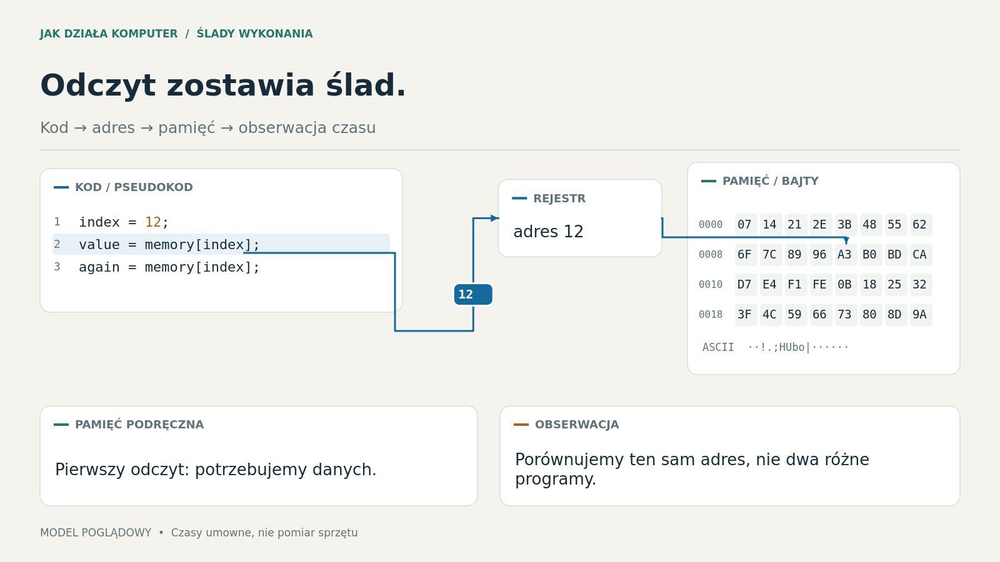

# Live Explain

A Python instrument for live technical explanation: three authored canonical narratives, controllable diagrams, explanatory detours, and a synchronized private script.

**Status: complete authored Polish talk and native Android preview; physical room rehearsal remains required.** The fullscreen audience application has been launched and inspected on Hyprland. A native Android script reader and remote now connects locally through the phone hotspot, with direct open HTTP access without pairing codes. See [Android setup](android/README.md).

**[Download Android 0.3.0 APK](https://github.com/aridlin/live-explain/releases/download/android-v0.3.0/live-explain-android-0.3.0-preview.apk)** · [Release history](https://github.com/aridlin/live-explain/releases)



## Run

Requires Python 3.12+ and [uv](https://docs.astral.sh/uv/). The lockfile pins the tested Python dependencies. No system Python modification is required.

```sh
uv sync --frozen
./run
```

The audience opens fullscreen. HDMI is preferred when Qt exposes an HDMI-named screen; select another output with `--screen N` (zero-based). Private notes are hidden until explicitly opened. On a single monitor, `P` opens the private presenter window for rehearsal; do not use that on a mirrored public desktop.

```sh
./run --windowed --presenter
./run --canonical deep
./run --screen 1
./run --remote  # show the Wi-Fi connection address; server runs on port 8080
```

After installation, `./run` uses the installed environment directly and works offline. Bundled DejaVu fonts are checked against a hash manifest and for Polish/technical glyph coverage before audience output opens.

| Key | Action |
|---|---|
| Right | Start next step; at the final hold, enter the next beat |
| Space | Play/pause; also pauses a composition transition |
| Down | Complete one semantic step while paused |
| F | Finish the current sequence segment or composition transition |
| R | Return to the current segment's starting hold |
| Backspace | Resume the interrupted explanation, paused |
| U | Undo the last narrative navigation |
| P | Show/hide the private presenter window |
| B | Freeze and cover/uncover the audience output |
| F11 | Toggle fullscreen |
| Escape | Leave fullscreen |

The presenter window offers the Polish cue and full wording, current objective, return context, detour selector, three canonical continuations, prerequisite-bridge notice, playback scrubber, elapsed talk time, and output selection.

## Try the defining interactions

Use `./run --slice` for the compact engineering rehearsal, or `./run --beat normal.timing` within the full talk. The default `./run` starts the complete narrative. See [the presentation and pacing guide](PRESENTATION.md).

1. Start Normal and press Right. Pause halfway through the moving address.
2. Open the presenter with P; choose **Gdzie jest cache? → Wyjaśnij**.
3. Step through the cache-location explanation, then press Backspace. The original model, source focus, connector geometry, token position, and pending playback target return exactly, paused.
4. Repeat the detour, select **Szczegółowa**, then **Przejdź do tej kontynuacji**. Missing prerequisites enter the authored timing/cache-line bridge. Complete it and press Right to enter Deep's own initial state.
5. Continue the Normal branch example to see predicted work, a concealed value travelling to the cache trace, and the rejected architectural result. The visual conditional is separate from narrative detours.

Two nested detours are supported; a third is rejected. Repeated Advance during an active segment does not queue another step. Exposure markers do not indicate comprehension. Timing values are illustrative; no exploit or host-memory access runs.

## Tests and authoring

```sh
uv run pytest -q
uv run ruff check src tests
uv run ruff format --check src tests
uv build --offline
```

Tests cover navigation/bridges, interrupted restoration, replay, event boundaries, invalid content, disclosure, command receipts, geometry during move/resize, real viewport rendering, and reviewed visual baselines. Three reference PNGs use pinned fonts and a small pixel-difference tolerance; geometric assertions are strict. HDMI hotplug and back-row legibility still require projector rehearsal.

The implementation uses ordinary Python records and functions:

- `authoring.py`: Beat, Script, Event, Landing, Presentation and reference validation.
- `runtime.py`: authoritative session, deterministic event reconstruction, bounded detour/undo history, safe recovery and rehearsal journal.
- `geometry.py`, `components.py`, `visual.py`: reusable geometry, Qt components and centrally clocked transitions.
- `presentations/talk.py`, `talk_text.py`: all three full Polish routes, checkpoint landings, bridges and speaking material.
- `presentations/spectre.py`: retained compact engineering specimen and shared educational events.
- `presentations/spectre_scene.py`, `talk_scene.py`: persistent code/hex diagrams and authored full-talk compositions.
- `protocol.py`, `remote.py`: local command acceptance, cancellation receipts, epoch/revision checks and open local HTTP access.
- `android/`: native script reader and expandable remote control tray.

The larger API in [PLAN.md](PLAN.md) remains a proposal. These implemented modules are the current authoring interface; do not copy the proposed example and expect it to run unchanged.

## Capture, rehearsal and recovery

```sh
./run --capture artifacts/normal.png --beat normal.timing --position 1.68
./run --capture artifacts/cache.png --beat shared.location --position 3
./run --debug --windowed --presenter
./run --record artifacts/rehearsal.session.json
./run --replay-file artifacts/rehearsal.session.json
./run --recover
./run --export artifacts/fallback --canonical normal
```

Capture/export uses the same scene renderer, offline. Export places audience stills in `public/` and notes in a separately named **PRIVATE-presenter-script.txt**. A conventional image viewer can show the stills if the app fails; this is a degraded fallback without live interaction.

Recovery saves an atomic JSON safe canonical entry under the user's local state directory. It intentionally restarts paused with a new controller epoch; it is not a claim of exact crash recovery halfway through every animation. Rehearsal traces are content-version checked and reconstruct the recorded result without replaying network timing or obsolete phone taps.

## Performance and limits

```sh
uv run python -m live_explain.benchmark --live --slice --frames 180
uv run python -m live_explain.benchmark --live --frames 240
./run --benchmark 120
```

`--live` briefly opens two real windows and reports paint cost and callback intervals. Without it, the benchmark measures offscreen throughput, not display FPS. The dense fixture includes 30 code lines, 128 bytes, 24 components, 40 connectors and 24 tokens.

On the initial target run, the authored slice's two-window paint cost was approximately 9 ms median / 15 ms p95. Callback intervals were approximately 16 ms median / 24 ms p95, so the provisional 20 ms p95 interval gate is **not fully met**. These do not measure compositor presentation or photon latency. The dense stress fixture remains substantially over budget even after caching; no universal 60 FPS claim is made. See [VALIDATION.md](VALIDATION.md).

The next gates are physical phone/hotspot and projector rehearsal, timing the complete talk aloud, additional performance headroom, and fuller component ergonomics. Large-model virtualization, a graphical editor, universal routing, and a full CPU simulator remain deferred. Qt Quick remains a measured fallback for larger workloads.

## Design and licenses

- [Full A–M design and milestones](PLAN.md)
- [Long-term test specification](TEST_PLAN.md)
- [Current validation and remaining gates](VALIDATION.md)

Original code is MIT licensed. Bundled fonts retain their own license in `src/live_explain/assets/fonts/LICENSE.txt`. Qt/PySide and Pygments retain their dependency licenses; the project's MIT license does not relicense them. Local recordings, recovery data, desktop screenshots and diagnostics are excluded from Git.
